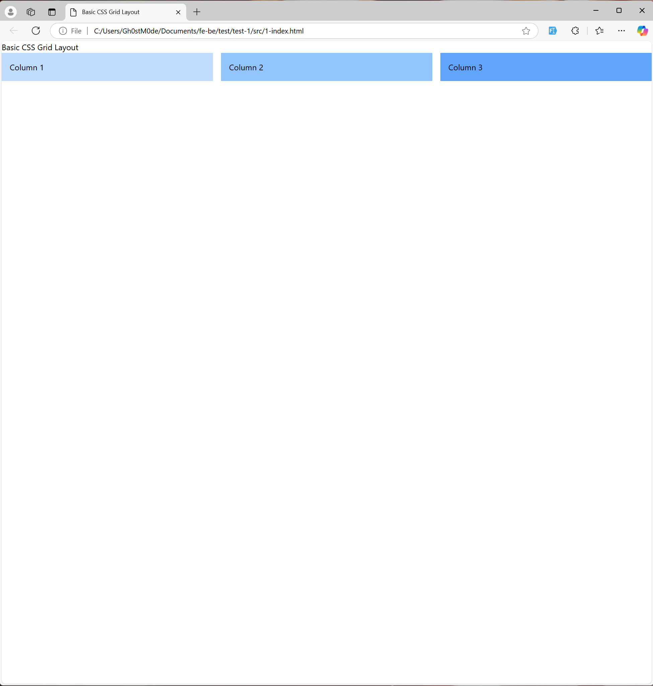

# CSS Grid and Flexbox: Creating Complex, Responsive Layouts using Tailwind

## Project Description

This project is a hands-on exploration of Tailwind CSS, focusing on building responsive and aesthetically pleasing web layouts. Each task is designed to introduce advanced Tailwind concepts, effectively utilize utility-first CSS for modern web development. We'll create layouts ranging from basic CSS grids and flexbox navigation bars to complex multi-section layouts that combine both CSS Grid and Flexbox. This progressive approach ensures a deep understanding of responsive design principles while mastering Tailwind CSS.

## Learning Objectives

- **Master Tailwind CSS Configuration**: Learn how to install and configure Tailwind CSS, enabling seamless integration into projects.
- **Build Responsive Layouts**: Implement complex, responsive layouts using Tailwind’s utility classes and responsive modifiers.
- **Combine CSS Grid and Flexbox**: Develop advanced page structures by leveraging both grid and flexbox techniques.
- **Design Aesthetically Pleasing Components**: Use Tailwind’s extensive styling utilities to create visually appealing designs with gradients, spacing, and colors.
- **Optimize for Professional Development**: Enhance professional web development skills by adhering to best practices in structuring, coding, and managing CSS frameworks.

## Requirements

- Node.js installed on the local machine. [Click here](https://nodejs.org/en/download/current)
- Basic knowledge of HTML, CSS, and JavaScript.
- Familiarity with a code editor (VSCode) and browser developer tools.
- GitHub account for repository management.
- Tailwind CSS installed via npm or CDN.
- Modern browser to render and test the designs.
- Internet connection for accessing Tailwind’s documentation and CDN links.

## Tasks

### 0. Setting Up and Installing Tailwind CSS with Configuration

**mandatory**
**Objective**: Set up and install tailwind

**Instructions**:

- Install `tailwind` css

- In your current working directory, create a file and name `tailwind.config.js`

Add the following code to it:

```json
/** @type {import('tailwindcss').Config} */
module.exports = {
  content: ["./src/**/*.{html,js}"],
  theme: {
    extend: {},
  },
  plugins: [],
}
```

- Create a directory `src` inside of your current working directory
- Create a file called `input.css` inside `src`

- Inside the file add the following code:

```json
@tailwind base;
@tailwind components;
@tailwind utilities;
```

- Run the tailwind CLI tool to scan your template files for classes and build your CSS `output.css`

```terminal
npx tailwindcss -i ./src/input.css -o ./src/output.css --watch
```

Note: To see Tailwind CSS take effect you need to leave this CLI open and running all through out your testing of the project.

**Repo:**

- **GitHub repository**: **alx-intermediate-frontend**
- **Directory**: **0x02-tailwind-css**
- **File**: [src/input.css](./src/input.css), [src/output.css](./src/output.css), [tailwind.config.js](./tailwind.config.js)

### 1. Creating a Responsive CSS Grid Layout with Tailwind CSS

**mandatory**
**Objective**: Leverage on tailwind to create the CSS grid layout

**Instructions**:

- Create a file 1-index.html

- Copy the following content into it:

```html
<!DOCTYPE html>
<html lang="en" dir="ltr">
<head>
    <meta charset="UTF-8">
    <meta name="viewport" content="width=device-width, initial-scale=1.0">
    <title>Basic CSS Grid Layout</title>
</head>
<body >
    <header>
        <h1>Basic CSS Grid Layout</h1>
    </header>

    <main>
        <div>Column 1</div>
        <div>Column 2</div>
        <div>Column 3</div>
    </main>
   </body>
</html>
```

- Let’s link our tailwind: Add the following code to the `head` tag in your 1-index.html

```html
<link href="./output.css" rel="stylesheet">
```

- Modify the `main` tag by creating a 3-column layout using css grid with a gap of 4. You can achieve this as follows:

```css
class="grid grid-cols-3 gap-4"
```

- Inside the main file, modify each `div` to have a background color of blue, with a shade level of 200 incremented by 100 across each `div`. Each should have a padding of 4 You can achieve this as follows:

```css
class="bg-blue-200 p-4"
class="bg-blue-300 p-4"
class="bg-blue-400 p-4"
```

- In the `input.css` file in your current directory, ensure the layout is responsive by adjusting the grid on smaller screens. You can achieve this by adding this code to it:

```css
@media (max-width: 768px) 
{ 
main { grid-template-columns: 1fr; } 
}
```

Run your 1-index,html using the command

- On Mac: open 1-index.html on your terminal
- On Windows: start 1-index.html on your terminal

Your output should be as follows:



**Repo:**

- **GitHub repository**: **alx-intermediate-frontend**
- **Directory**: **0x02-tailwind-css**
- **File**: [1-index.html](./1-index.html)

### 2. Building a Complex Page Layout with Nested CSS Grids Using Tailwind CSS

**mandatory**

**Objective:-** implement a more complex layout using nested grids for multiple sections of a page of the page

**Instructions:**

Create a new file `2-index.html` and add the following content to it:

```html
<!DOCTYPE html>
<html lang="en">
<head>
    <meta charset="UTF-8">
    <meta name="viewport" content="width=device-width, initial-scale=1.0">
    <title>Complex Grid Layout</title>
<link href="./output.css" rel="stylesheet">
</head>
<body>
    <header>
        <h1>Complex Grid Layout with Nested Grids</h1>
    </header>

    <main>
        <div>
            <div>Nested 1</div>
            <div>Nested 2</div>
        </div>
        <div>
            <div>Nested 3</div>
            <div>Nested 4</div>
        </div>
        <div class="bg-green-200 p-4">Content 3</div>
        <div class="bg-yellow-200 p-4">Content 4</div>
    </main>
    </body>
</html>
```

- Let’s start by adding basic styling to the page: give the `body` a padding of 4.

- Using tailwind’s grid utilities create a 2 x 2 grid layout with nested grids inside each grid cell. You can achieve this by:

inside the main tag, create 2 grid columns each with a gap of 4. i.e

```css
class="grid grid-cols-2 gap-4"
```

in the first div, create another grid with 2 cols, background color of blue, paddinng 4 and a gap of 2

```css
class="grid grid-cols-2 p-4 gap-2 bg-blue-200"
```

in the Nested 1 and Nested 2 divs, add a blue background color with a gradient of 400 and 500 respectively and a padding of 2:

``` class="bg-blue-400 p-2" ```

``` class="bg-blue-500 p-2" ```
Do the same to the second div only this time change background colour to red

```css
class="grid grid-cols-2 p-4 gap-2 bg-red-200"
```

Open your `2-index.html` in the browser. Your output should be as follows:


**Repo:**

- **GitHub repository**: **alx-intermediate-frontend**
- **Directory**: **0x02-tailwind-css**
- **File**: [2-index.html](./2-index.html)

### 3. Flexbox Basics - Build a Simple Navigation Bar

**mandatory**
**Objective:** Use Tailwind and Flexbox to create a horizontal navigation bar that adjusts to different screen sizes.

**Instructions:**

In this task, we will build a simple horizontal navigation bar using tailwind and flex box

- Create a file named `3-nav_index.html` and inside it, add the following code:

```html
<!DOCTYPE html>
<html lang="en">
<head>
    <meta charset="UTF-8">
    <meta name="viewport" content="width=device-width, initial-scale=1.0">
    <title>Flexbox Navigation Bar</title>
<link href="./output.css" rel="stylesheet">
<style>
        @media (max-width: 768px) {
            nav {
                flex-direction: column;
                align-items: flex-start;
            }
        }
    </style>
</head>
<body class="p-4">
    <header class="mb-4">
        <h1 class="text-3xl font-bold">Flexbox Navigation Bar</h1>
    </header>

</body>
</html>
```

- Inside the body tag, after the header create a nav tag, with 4 a tags referring to Home, About, Services and contacts . This should be as follows:

```html
<nav> 
<a href="#">Home</a> 
<a href="#">About</a> 
<a href="#">Services</a> 
<a href="#">Contact</a> 
</nav>
```

- Inside the `nav` add the following:

```css
class="flex space-x-5 justify-center bg-gray-300 text-white p-4"
```

In each `a` apply the following inline utility classes

```css
class="px-2 text-xl hover:bg-gray-500 p-2 rounded-lg"
```

Open your `3-nav_index.html` in the browser. It should look like this:


**Repo:**

- **GitHub repository**: **alx-intermediate-frontend**
- **Directory**: **0x02-tailwind-css**
- **File**: [3-nav_index.html](./3-nav_index.html)

### 4. Create a Responsive Flexbox Layout with Tailwind

**mandatory**
**Objective**: The goal of this task is to build a responsive page layout with tailwind’s utility classes, while using tailwind CDN

**Instructions**:

Create a new file `4-flexbox_index.html`. Inside it add the following code:

```html
<!DOCTYPE html>
<html lang="en">
<head>
    <meta charset="UTF-8">
    <meta name="viewport" content="width=device-width, initial-scale=1.0">
    <title>Responsive Flexbox Layout</title>
    <style>
      @media (max-width: 768px) {
          main {
              flex-direction: column;
          }
      }
  </style>
</head>
<body class="p-4">
    <header class="mb-4">
        <h1 class="text-3xl text-red-700 font-bold">Responsive Flexbox Layout</h1>
    </header>

    <main>
        <aside>Sidebar</aside>
        <section>Content Section</section>
    </main>

    <script src="https://cdn.tailwindcss.com"></script>  
</body>
</html>
```

- Add `flex` class to the `main` tag

- Inside the `aside` tag, partition the width such that it occupies one third of the available width space. Give it a gray background color with a padding of 4 i.e:

```css
class="w-1/3 bg-gray-300 p-4"
```

- The `section` tag should occupy the remaining ⅔ in width space, padding 4 and a gray background color with a gradient of 500

Open your html file in the browser. Your output should be as follows:


**Repo:**

- **GitHub repository**: **alx-intermediate-frontend**
- **Directory**: **0x02-tailwind-css**
- **File**: [4-flexbox_index.html](./4-flexbox_index.html)

### 5. Combine CSS Grid and Flexbox for a Multi-Section Layout

**mandatory**
**Objective**: combine both grid and flexbox to create a responsive layout

**Instructions**:

- Create a file `5-gridflex_index.html` and inside it add the following code:

```html
<!DOCTYPE html>
<html lang="en">
<head>
    <meta charset="UTF-8">
    <meta name="viewport" content="width=device-width, initial-scale=1.0">
    <title>Grid and Flexbox Layout</title>
    <script src="https://cdn.tailwindcss.com"></script>
            <style>
        @media (max-width: 768px) {
            main {
                grid-template-columns: 1fr;
            }
        }
    </style>
</head>
<body class="p-4">
    <header class="bg-blue-500 text-white p-4">
        <h1 class="text-3xl">Grid and Flexbox Layout</h1>
    </header>

    <main>
        <section>
            <div>Flexbox Item 1</div>
            <div>Flexbox Item 2</div>
        </section>
        <aside class="bg-green-200 p-4">Sidebar</aside>
    </main>

    <footer class="bg-gray-800 text-white p-4 mt-4">
        <p>&copy; 2024 John Doe's Blog</p>
    </footer>
</body>
</html>
```

- In the `main` tag create a grid layout with a default 1 column on smaller screens and 3 columns on larger screens. It should a spacing of 4 and a margin top of 4. This can be achieved as:

```css
class="grid grid-cols-1 lg:grid-cols-3 gap-4 mt-4 min-h-screen"
```

- In the `section` tag, specify that the large screen column should span 2 columns. Equally apply a flex layout to the element

```css
class="lg:col-span-2 flex"
```

- Each `div` in the section tag, should have a padding of 4, red background color with a gradient of 200 and 400 respectively and should each occupy a width of ½

- Open your file on the browser. Your output should be as follows:


**Repo:**

- **GitHub repository**: **alx-intermediate-frontend**
- **Directory**: **0x02-tailwind-css**
- **File**: [5-gridflex_index.html](./5-gridflex_index.html)

### 6. Build a Responsive Image Gallery Using CSS Grid

**mandatory**
**Objective**: Expand on the previous layout by adding a responsive image gallery using CSS grid

**Instruction:**

Use the existing layout from the previous task in a file 6-imageGallery.html

Create an additional section for an image gallery below the existing content.

Use CSS Grid to arrange the images in a 3-column layout.

On smaller screens, the gallery should adjust to display one image per row.

Make sure the images are responsive, resizing properly on different screen sizes.

Open your file in the browser. Your output should be as follows:

**Repo:**

- **GitHub repository**: **alx-intermediate-frontend**
- **Directory**: **0x02-tailwind-css**
- **File**: [6-imageGallery.html](6-imageGallery.html)
